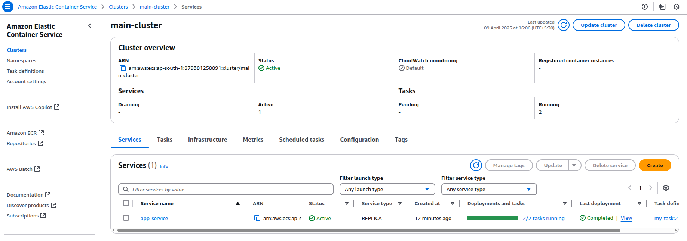
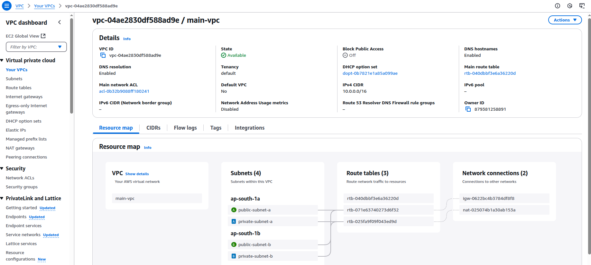

# Terraform ECS Fargate Infrastructure on AWS

This project provisions a complete server-based infrastructure on AWS using **Terraform**. It deploys a containerized application to **AWS ECS Fargate** behind a **Load Balancer**, within a secure **VPC** network.

## Key Components Included:

- **VPC** with:
  - 2 Public Subnets
  - 2 Private Subnets
  - Internet Gateway (for public access)
  - NAT Gateway (for outbound internet access from private subnets)
- **Security Groups** for ECS and Load Balancer
- **ECS Cluster** (Fargate Launch Type)
- **ECS Task Definition** and **Service**
  - Runs container in **private subnets**
- **Application Load Balancer**
  - In public subnets
  - Forwards traffic to ECS service in private subnets

## Steps 
- create terraform.tf file and Outputs.tf file
- write code in terraform.tf file and output.tf file 

    [terraform.tf](terraform.tf)

    [output.tf](outputs.tf)

- verify AWS CLI installed using :

      aws --version

- check aws configuration using :

      aws configure list

- It will show :
     
      profile

      access_key

      secret_key

      region

- Initialize the Terraform using :
    
      terraform init

- Validate the configuration using :

      terraform validate

- Review the plan using :
  
      terraform plan

- Apply the plan using :

      terraform apply

- To monitor Deployment 
  
  1) Go to AWS Console → ECS → View your cluster & service

      

  2) Go to EC2 → Load Balancers → Check DNS name

      

  3) Go to VPC to verify subnets, NAT, etc.
     
      

- Access the Application using browser
  
      http://<alb-dns-name>

